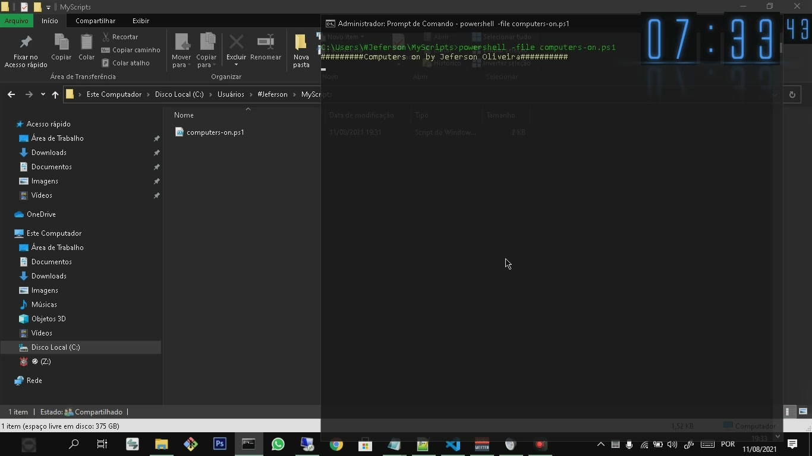
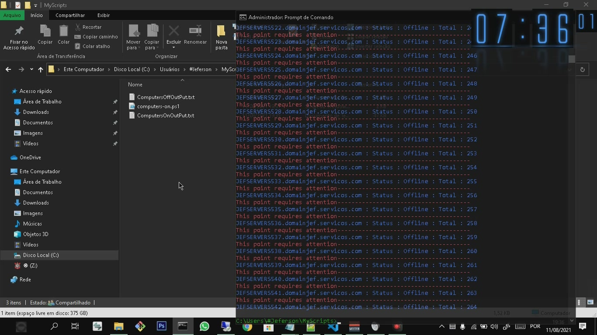
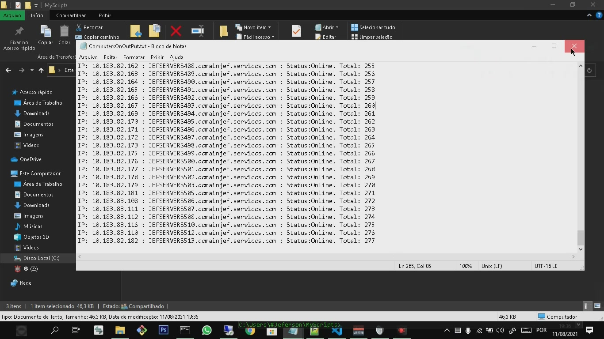
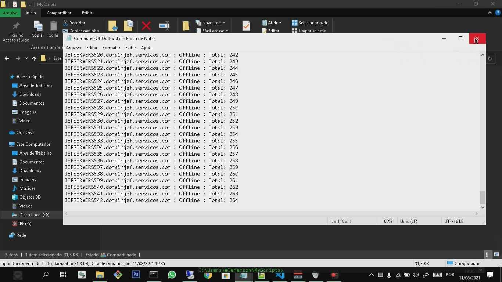

# computers-online  by Windows Powershell

Check computers on the domain network by name. Ex: name(number)(domain) server1.domain.com 

<h2>Objective</h2>

In my work I always need to connect to a vpn, to make an RDP connection to computers on the domain network, and with script I can see which computers are online and working 

