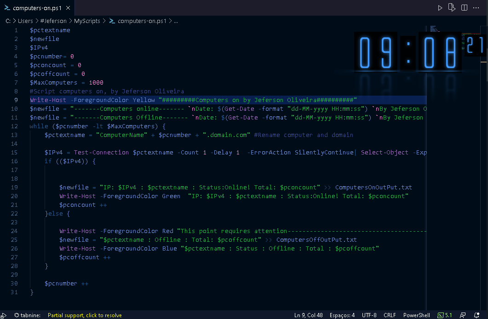

# computers-online  by Windows Powershell

Check computers on the domain network by name. Ex: name(number)(domain) server1.domain.com 

<h2>Objective</h2>
  <a href="https://www.youtube.com/watch?v=M5NMQYSCPAw">Look at the script working on youtube</a>
  
  

In my work I always need to connect to a vpn, to make an RDP connection to computers on the domain network, and with script I can see which computers are online and working 

